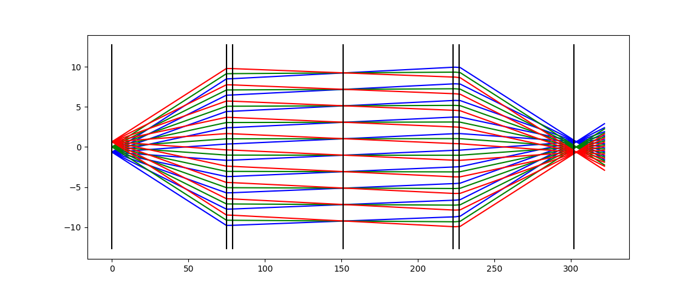

# RayTransferMatrix

A library for calculate Ray Transfrom Matrix.

## Example

4F system with 1" lenses with 10cm focus
```python
n_air = 1.0
n_N_BK7 = 1.5106
rad_curv = 38.6
c_thick = 4.1
f = 74.8
fb = 72.0

for j in [(-1.3/2,'b'),(0,'g'),(1.3/2,'r')]:
    for i in np.linspace(-7,7,10):
        p = rvec(j[0],np.deg2rad(i))
        q = rvec_list(p)

        # Calculations
        q <<(~q).propagate(f)
        q <<(~q).thick_lens(n_air, n_N_BK7, rad_curv, -np.inf, c_thick)
        q <<(~q).propagate(2*fb)
        q <<(~q).thick_lens(n_air, n_N_BK7, np.inf, -rad_curv, c_thick)
        q <<(~q).propagate(f+20)

        # Draw
        z = np.linspace(q.range_z()[0],q.range_z()[1],100)
        x = np.interp(z,q.s_z(),q.s_x())
        plt.plot(z,x,j[1])

line_pos = np.zeros(2)
for i in [0,f,c_thick,fb,fb,c_thick,f]:
    line_pos += i
    plt.plot(line_pos,[-25.4/2,25.4/2],'k')
plt.show()
```

Result:

